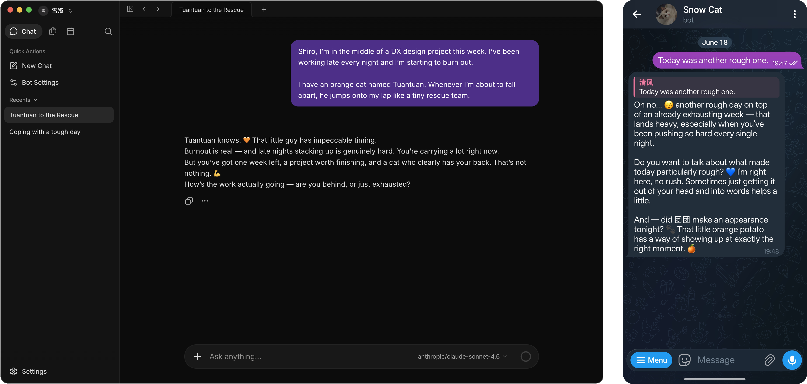

<div align="right">
  <span>[<a href="./README.md">English</a>]<span>
  </span>[<a href="./README_CN.md">简体中文</a>]</span>
  </span>[<a href="./README_JA.md">日本語</a>]</span>
</div>  

<div align="center">
  
  <h1>Sophia</h1>
  <p>给每个 AI Agent 一台云端电脑，开源<br>
  桌面、浏览器、网络与长期记忆 — 即使关上笔记本，Agent 也不会停</p>
  <div align="center">
    
    
    
    <a href="https://deepwiki.com/sophiaai/Sophia">
      
    </a>
    <a href="https://t.me/sophiaai">
      
    </a>
  </div>
  <h3>
    <a href="https://sophia.ai/waitlist">Sophia Cloud</a> · <a href="#部署到服务器">部署到服务器</a> · <a href="https://docs.sophia.ai">文档</a> · <a href="https://sophia.ai">官网</a> · <a href="https://x.com/sophia_ai">X</a>
  </h3>
  
</div>

## Sophia 是什么？

Sophia 是一个开源的多智能体平台。每个 Agent 都有一台自己的云端电脑 — 独立的 Workspace，配有文件系统、桌面、浏览器、网络和长期记忆。你的 Agent 全天候在线，即使关上笔记本也不会停。

你可以用自己的 API Key 运行 Sophia 内置 Agent，也可以把已有的 Claude Code、Codex Agent 托管到 Sophia Workspace 里。

通过 Telegram、Discord、飞书、微信、Web UI 等渠道与它们对话。它们能跨会话、跨平台记住上下文，操作浏览器，调用 MCP 工具，执行定时任务。给自己跑一个，给团队成员各分配一个，或一次拉起一组。

## 开始使用

### Sophia Cloud

> [!TIP]
> Sophia Cloud 即将上线 — 零配置、Agent 全天候运行在云端。在 [sophia.ai/waitlist](https://sophia.ai/waitlist) 加入等待列表。

### 部署到服务器

在自己的基础设施上自托管完整服务。

```bash
curl -fsSL https://sophia.sh | sh
```

<details>
<summary><strong>更多部署选项</strong></summary>

```bash
git clone --depth 1 --recurse-submodules --shallow-submodules https://github.com/sophiaai/Sophia.git
cd Sophia
cp conf/app.docker.toml config.toml
# 编辑 config.toml
export SOPHIA_INTERNAL_RPC_SHARED_SECRET="$(openssl rand -hex 32)"
docker compose up -d
```

Compose 会分别启动 Server 和 Channel 服务。请妥善保存内部 RPC 密钥，重新创建服务时继续使用同一个值。

不使用 Docker（或从已有裸机部署升级）？在 `config.toml` 中将 `internal_rpc.shared_secret` 留空即可：Server 会内嵌 Channel 运行时，继续以单进程 all-in-one 方式运行——外部渠道、Email、webhook 端点全部保留，无需运行 `sophia-channel` 进程。设置密钥则切换为双进程拆分部署。

执行过 setup 的已有仓库仍然可以继续使用 `git pull`：post-merge hook 会初始化新增的
submodule，setup 也会为后续 pull 启用递归更新。如果从未安装过该 hook，升级后只需执行
一次 `mise run submodule-init`。GitHub 自动生成的
“Source code” 压缩包不包含 submodule，请改用 Release 附件中的
`Sophia-<version>-source.zip` 或 `.tar.gz` 完整源码包。

> **镜像拉取慢时可用国内镜像：**
> ```bash
> curl -fsSL https://sophia.sh | USE_CN_MIRROR=true sh
> ```
>
> 不要对整个安装脚本用 `sudo`。需要时脚本内部会自行调用 `sudo docker`。在 macOS 上，或用户已在 `docker` 组时，连 Docker 也不必 sudo。

自定义与生产环境见 [DEPLOYMENT.md](DEPLOYMENT.md)。

</details>

## 为什么选 Sophia？

- **每个 Agent 一台电脑**：独立 Workspace，自带文件系统、网络、桌面和浏览器
- **多用户、多机器人**：给自己跑一个，给家人各部署一个，在一台机器上同时跑一群
- **轻量**：可以自托管在自己的基础设施上，也可以连接 Sophia Cloud

## 功能概览

- **多机多人**：多个机器人，可私聊、可群聊、可互相对话，支持跨平台身份绑定
- **隔离 Workspace**：每个机器人都有独立的文件系统、网络、工具和桌面环境
- **内置记忆**：跨会话、跨平台的长期记忆，开箱即用，也支持接入 [Mem0](https://mem0.ai)、OpenViking
- **十余种渠道**：Telegram、Discord、飞书、微信、QQ、邮件等
- **MCP**：接入外部工具服务，每个机器人独立管理连接
- **插件**：安装打包好的技能、工具和集成，扩展机器人的能力
- **Agent 托管**：通过 ACP 在 Sophia Workspace 内托管外部 Agent，目前支持 Codex 和 Claude Code，每个机器人独立配置
- **Browser Use**：在 Workspace 内驱动浏览器
- **Computer Use**：操作 Workspace 桌面，处理需要 GUI 的工作流
- **技能与应用超市**：模块化技能，从超市安装模板，重活交给子智能体
- **自动化**：定时任务与周期心跳

## 为本项目拆出的子项目

- [**Twilight AI**](https://github.com/sophiaai/twilight-ai) — 给 Go 用的轻量 AI SDK，风格参考 [Vercel AI SDK](https://sdk.vercel.ai/)
- [**Connect It**](https://github.com/sophiaai/connect-it) — 自托管的连接器网关，安全保存 SaaS 凭据，并通过单个 MCP 端点让 Agent 使用各种集成
- [**UI**](https://github.com/sophiaai/ui) — 面向 AI Agent 管理界面的 Vue 3 设计系统，包含组件库、设计令牌，以及指导 Agent 正确使用它们的技能

## 项目状态

    

## Star 历史

[](https://www.star-history.com/#sophiaai/Sophia&type=date&legend=top-left)

## 贡献者

<a href="https://github.com/sophiaai/Sophia/graphs/contributors">
  
</a>

## 社区

- 🌐 [**网站**](https://sophia.ai)
- 📚 [**文档**](https://docs.sophia.ai) — 安装、概念与指南
- 🤝 [**合作**](mailto:business@sophia.net) — business@sophia.net
- 💬 [**Telegram 群组**](https://t.me/sophiaai) — 交流与支持
- 🛒 [**应用超市**](https://github.com/sophiaai/supermarket) — 整理好的技能与 MCP 模板

---

**许可证**：AGPLv3

Made with ❤️ by SophiaAI Team,

Copyright (C) 2026 SophiaAI (sophia.ai). All rights reserved.
